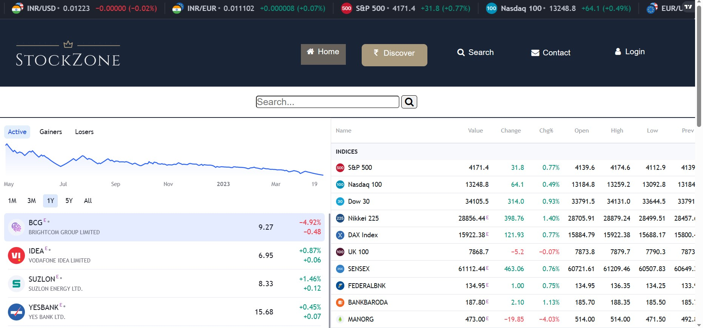
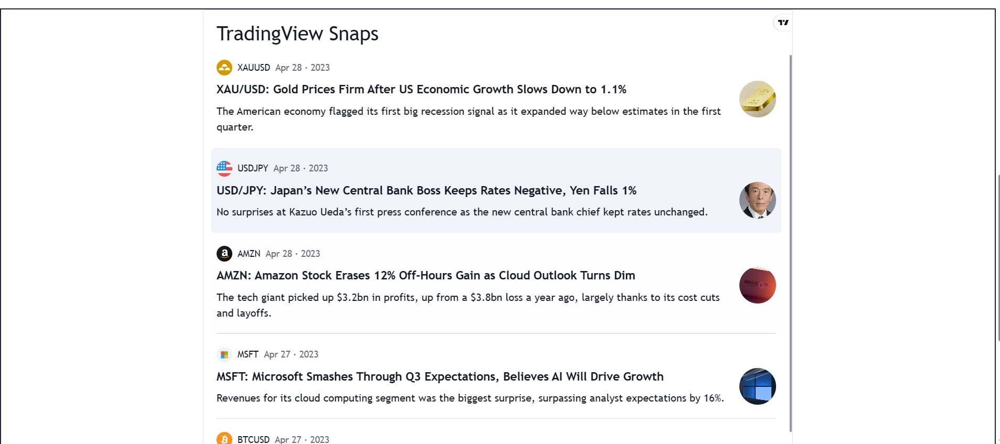
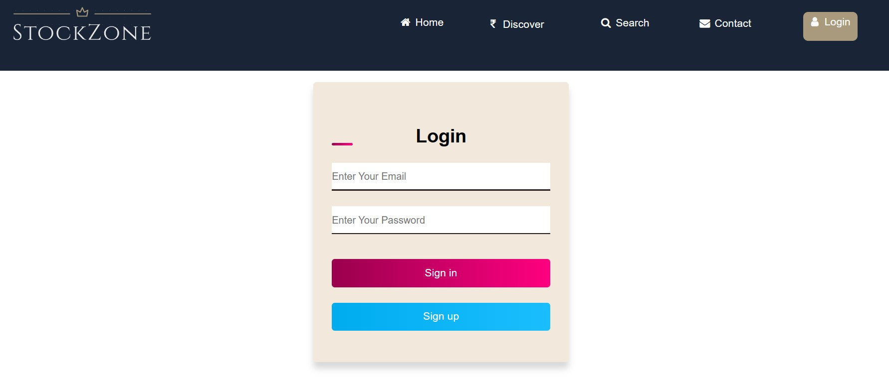
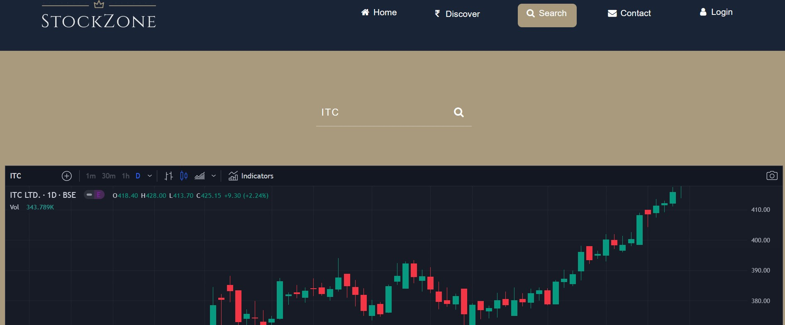

A MERN Stack project which gives real-time data on stocks and news updates.

**Install dependencies (in root folder):-**

```npm -i```

**To run:-**

```npm run start```

Navigate to the following URL using a browser:

```localhost:5000/home```

Navigate within the page using navbar

**Screenshots:**


Discover Page




Login Page



Search Page




Disclaimer:

Please note that the data required, as well as the APIs provided for the development of this project is provided by [TradingView](https://in.tradingview.com/ "TradingView")
